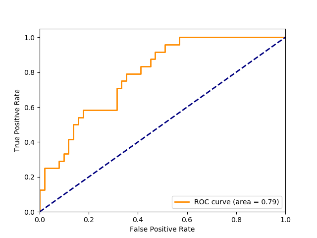
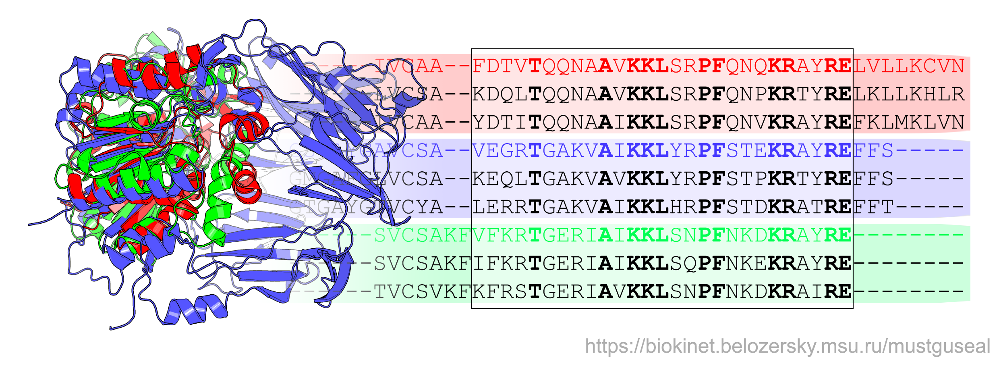
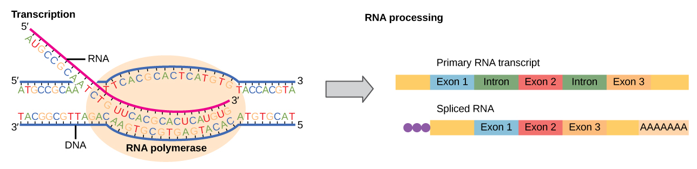

--- 
title:
- Predicción de patogenicidad en SNPs usando Aprendizaje Automático 
subtitle: 
- Tesis de Licenciatura en Ciencias de la Computación
author:
- 'Martín Ezequiel Langberg \newline Directores: Ariel Berenstein y Pablo Turjanski \newline Jurado: Viviana Cotik y Marcelo Martí'
institute: 
- Departamento de Computación, FCEyN, UBA
theme:
- Boadilla
colortheme:
- beaver
lang: es
---

# Motivación del trabajo

* Existen variantes en el ADN causantes de enfermedades (patogénicas)
\vspace*{2\baselineskip} 
* La detección de estas variantes es esencial para el avance de la medicina personalizada
\vspace*{2\baselineskip} 
* Queremos poder predecir la patogenicidad de un SNP en el ADN usando métodos computacionales 

---

# ¿Qué son los SNPs?

{ width=350px }

---

# Del ADN a las proteínas

{ width=450px }

---

# ¿Cómo se expresan los SNPs en el organismo?

{ width=250px }

---

# Tipos de SNPs

::: block1
## Sustitución sinónima o \textit{silent}
El cambio en el nucleótido no modifica el aminoácido
:::

:::columns

::::column
{ width=250px }
::::

::::column
{ width=180px }
::::

:::

\center{Sustitución \textit{silent}}

---

# Tipos de SNPs

:::block2
## Sustituciones no sinónimas
Nonsense: Generan un codón de terminación o \textit{stop}
:::

:::columns

::::column
{ width=250px }
::::

::::column
{ width=180px }
::::

:::

\center{Sustitución \textit{nonsense}}

---

# Tipos de SNPs

:::block2
## Sustituciones no sinónimas
Missense: Generan un cambio de aminoácido en la proteína
:::

:::columns

::::column
{ width=250px }
::::

::::column
{ width=180px }
::::

:::

\center{Sustitución \textit{missense}}

---

# Foco de estudio: Variantes \textit{missense}

::: block1
## Sustitución sinónima o \textit{silent}
* El cambio en el nucleótido no modifica el aminoácido
:::

:::block2
## Sustituciones no sinónimas
* Nonsense: Generan un codón de terminación o \textit{stop}
* Missense: Generan un cambio de aminoácido en la proteína

:::

---

# Bases de datos biológicas

* Existen bases de datos biológicas que registran patogenicidad de variantes: 
	* Clinvar (pública): Variantes de distinto nivel de confianza 
	* **Humsavar (pública): Solamente variantes missense** 
	* HGMD (privada)

  Swiss Prot AC    AA change     Type of variant   dbSNP
  ---------------- ------------- ----------------- -------------
  Q9NPC4           p.Pro251Leu   Polymorphism      rs28940571
  Q9NPC4           p.Gln163Arg   Polymorphism      rs28915383
  Q9NPC4           p.Ala218Asp   Polymorphism      rs2246945
  Q9NRG9           p.His160Arg   Disease           \-
  Q9NRG9           p.Ser263Pro   Disease           rs121918550

  \center{Selección de columnas de tabla Humsavar (extracto)}

---

# Enfoque computacional: un problema de clasificación

* **Objetivo: Poder predecir si un SNPs missense es benigno o patogénico**

* Trabajos previos: 
	* VEST (Carter et al., 2013)	
	* FATHMM-MKL (Shihab et al., 2015)
	* REVEL (Ioannidis et al., 2016)
	* VarQ (Santiago Moreno, en proceso)
\vspace*{1\baselineskip}
* Aprendizaje automático supervisado
\vspace*{1\baselineskip} 
* Dimensiones estructurales, físico-químicas de las proteínas, genómica
\vspace*{1\baselineskip}
* Análisis de importancia de los features

---

# Principal métrica de desempeño: AUC (Area bajo la curva)

::: columns

:::: column
{ width=220px }
::::

:::: column
### Rango de valores 
* \small AUC = 1: Predictor ideal
* \small AUC = 0.5: Predictor \textit{random}

### Principales ventajas
* \small Independiente del umbral de clasificación
* \small No es sensible a desbalances en los datos
::::

:::

---

# 

\begin{center}
\Huge ¿Qué tan difícil es este problema?
\end{center}

---

# Primer modelo: Propiedades estructurales usando VarQ

::: {.block1}
{ width=250px }
:::

::: {.block2}
### Features extraídos (cobertura)

:::: columns

::: column
* Variación de la energía (100%)
* SASA (95%)
* Porcentaje de SASA (95%)
* B-Factor (95%)
* Switchability (90%)
:::

::: column
* Aggregability (72%)
* Conservación (37%)
* Interfaz 3DID (100%)
* Interfaz PDB (100%)
* **Active Site (5%)** 
:::

::::

:::

---

# Filtrado de variantes del dataset VarQ

* Removimos variantes sin un status confirmado (\textit{risk factor}, \textit{likely benign}, \textit{uncertain significance})
* Aproximadamente 7.5k variantes: 72% patogénicas, 28% benignas
* Dataset VarQ Curado

{ width=250px }

---

# Generación de modelos de aprendizaje automático

* Modelos clásicos usando \texttt{scikit-learn}
	* Support Vector Classifier (kernel radial)
	* Random Forest
	* Regresión logística
\vspace*{2\baselineskip} 
* Imputación de features nulos
	* Mediana para features continuos
	* Media para features categóricos (PDB, 3DID)
\vspace*{2\baselineskip} 
* Búsqueda de hiperparámetros usando \textit{Grid-search} y validación cruzada
\vspace*{2\baselineskip} 
* 70% dataset de entrenamiento, 30% dataset de test

---

# El modelo Random Forest obtuvo el mejor AUC

                        SVC        LR       RF
  --------------------- ---------- -------- --------
  Precisión             0.72       0.75     0.77
  Recall                1.00       0.94     0.93
  **AUC**               **0.70**   **0.71** **0.74**
  $T_{fit}$             2m 39s     1.17s    9.82s
  $T_{pred}$            0.77s      0.01s    0.11s

* Mejores hiperparamétros encontrados (RF):
	* Profundidad de árbol: 7
	* Estimadores: 100
	* Cantidad de variables por árbol: 4

---

# La variación de la energía es el feature más importante

::: columns

:::: column
{ width=250px }
::::

:::: column
{ width=170px }

* **AUC VarQ Curado: 0.74**
* \small AUC VEST: 0.84 
* \small AUC FATHMM-MKL: 0.82 
* \small AUC REVEL: 0.90

::::

:::

---

# 

::: {.block1}
\begin{center}
\Huge ¿Cuál es el valor predictivo de las propiedades fisico-químicas de la proteína?
\end{center}
:::

::: {.block2}
{ width=450px }
:::

---

# Modelo: Propiedades Físico-Químicas de la proteína

* **Usando únicamente la tabla Humsavar**: 
	* Más de 68 mil variantes (aprox. x10 Varq!)
	* Status aportado por Humsavar
* Uniprot: Proteoma humano completo
* Nuevas fuentes de features:
	* ProtParam (Biopython) 
	* SNVBox

{ width=350px }

---

# Generación de nuevos features usando ProtParam

::: {.block1}
### Parámetros calculados
* Punto isoeléctrico
* Aromaticidad
* Índice de inestabilidad
* Flexibilidad
* Promedio de hidrofobicidad
:::

::: {.block2}
### Cambio en la variante
* Diferencia: $x_{var} - x$
* Log-ratio: $log(x_{var}) / log(x)$
:::

::: {.block3}
\center { width=350px }
\tiny Gasteiger et al., 2005
:::
---

# Variables físico-químicas extraídas de SNVBox

::: {.block1}
### Variables a nivel de aminoácido (considerando sustitución)
* Score BLOSUM, EX, GRANTHAM, PAM250, VB, JM
* Carga 
* Volumen 
* Polaridad
* Hidrofobicidad
* Transición
:::

::: {.block2}
### Variables a nivel de proteína (sin considerar sustitución)
* BINDING: Sitio de unión
* ACTIVE_SITE: Sitio activo
* LIPID: Unión con un lípido 
* METAL: Unión con un metal
:::

* Base de datos generada en la Universidad Johns Hopkins
\tiny Wong et al., 2011

---

# Modificamos nuestro análisis de importancia

* Generamos un nuevo modelo basado en Random Forest
\vspace*{2\baselineskip} 
* Reutilizamos el pipeline usado en el modelo anterior (Pipeline Tree)
	* Misma imputación de variables
	* Mismo esquema de entrenamiento y test
\vspace*{2\baselineskip} 
* Mejores hiperparámetros encontrados:
	* Profundidad de árbol: 7
	* Estimadores: 100
	* Cantidad de variables por árbol: 20%
\vspace*{2\baselineskip} 
* Usamos \texttt{rfpimp} para calcular la importancia de las variables

---

# Las matrices de sustitución fueron las más relevantes

::: columns

:::: column
{ width=230px }
::::

:::: column
{ width=185px }

* **AUC Físico-Químico: 0.72**
* \small AUC VarQ: 0.74

::::

:::
---

#

::: {.block1}
\begin{center}
\Huge ¿Cuál es el valor predictivo de los features genómicos?
\end{center}
:::

::: {.block2}
{ width=450px }
:::

---

# Modelo: Variables genómicas

* Identificador rsID: aproximadamente 55k variantes en Humsavar
	* 68% variantes benignas
	* 32% variantes patogénicas

* Fuentes de features: 
	* SNVBox 
	* dbSNP 
	* Genome Browser (UCSC)

{ width=450px }

# Features del modelo Genómico

::: {.block1}
### Features de conservación genómica
* PhastCons a 46 vías (vertebrados)
* PhyloP a 46 vías (vertebrados)

:::

::: {.block2}
### Features extraídas de SNVBox
* Conservación a nivel de exón
* Densidad de SNPs en HapMap
* Densidad de SNPs a nivel de exón
:::

::: {.block3}
### Features relativas a la clase funcional
* Missense
* Nonsense
* Intrón
:::

* \small Hiperparámetros: Profundidad 7, 100 estimadores, 7 variables por corte

---

# La conservación genómica aportó un salto en el AUC

::: columns

:::: column
{ width=235px }
::::

:::: column
{ width=175px }

* **AUC Genómico: 0.85**
* \small AUC Físico-Químico: 0.72
* \small AUC VarQ: 0.74
::::

:::

---

#

\begin{center}
\Huge ¿Podemos mejorar el modelo genómico integrando los features físico-químicos?
\end{center}

---

# Integramos los features físico-químicos y genómicos

* Dataset Humsavar: 68k variantes
* Cobertura features genómicos: aprox. 80%
* Evaluamos un nuevo método de aprendizaje automático: XGBoost

{ width=250px }

---

# XGBoost es un algoritmo de Boosting

* Es un algoritmo iterativo
\vspace*{1\baselineskip}
* Muy usado en competencias (por ejemplo Kaggle)
\vspace*{1\baselineskip} 
* Para la búsqueda de hiperparámetros usamos Randomized Grid Search
\vspace*{1\baselineskip} 
* Mejores hiperparámetros encontrados: 
	* Peso mínimo de las hojas: 5 
	* Gamma: 5
	* Muestreo: 0.8
	* Cantidad de variables por árbol: 0.8
	* Profundidad máxima:  0.8

---

# XGBoost permitió alcanzar al mejor trabajo del área

::: columns

:::: column
{ width=235px }
::::

:::: column
{ width=200px }

* **AUC Integral: 0.90**
* \small AUC VEST: 0.84 
* \small AUC FATHMM-MKL: 0.82 
* **\small AUC REVEL: 0.90**
::::

:::

---

#

{ width=300px }

---

\begin{center}
\Huge ¿Qué sucede al sumar estos features al dataset VarQ?
\end{center}

---

# Sumamos las nuevas variables al dataset VarQ

* Unimos los features del dataset Integral al dataset VarQ Curado
* 72 features: 9 de VarQ + 63 de Integral
* 7.4k variantes: 72% patogénicas, 28% benignas
* Comparamos XGBoost con Random Forest nuevamente

{ width=300px }

# Importancia transversal a todas las dimensiones estudiadas

::: columns

:::: column
{ width=235px }
::::

:::: column
{ width=175px }

* **AUC VarQ+Integral: 0.88**
* \small AUC VarQ Curado: 0.74
::::

:::

---

#

{ width=300px }

---

# Conclusiones

* La combinación de distintas dimensiones del problema aportó excelentes resultados, consiguiendo un AUC de 0.90. Los features de conservación (genómicos y matrices de sustitución) fueron las que más aportaron al desempeño del modelo
\vspace*{2\baselineskip} 
* El método estándar de cálculo de importancia de features usado por scikit-learn puede ser engañoso en el caso de features altamente correlacionados
\vspace*{2\baselineskip} 
* La exploración de un algoritmo más avanzado (XGBoost) aportó mejoras sustanciales al modelo

---

# Trabajo futuro

* Aumentar la cobertura de los features más importantes: La variación de la energía y las features de conservación genómica
\vspace*{2\baselineskip} 
* Mejorar la búsqueda de hiperparámetros en XGBoost
\vspace*{2\baselineskip} 
* Evaluar SNPs en regiones no codificantes (FATHMM-MKL)

# 

\begin{center}
\Huge ¿Preguntas?
\end{center}

# 

\begin{center}
\Huge ¡Muchas gracias!
\end{center}

