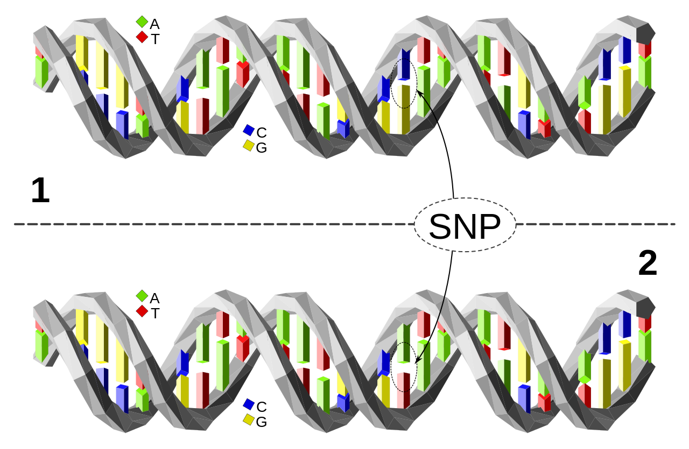
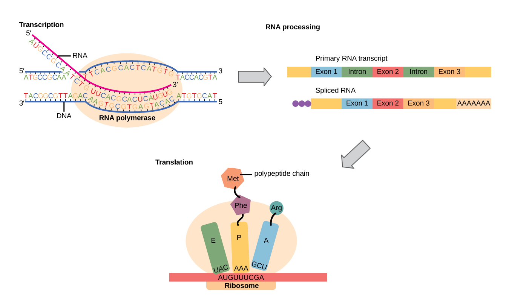
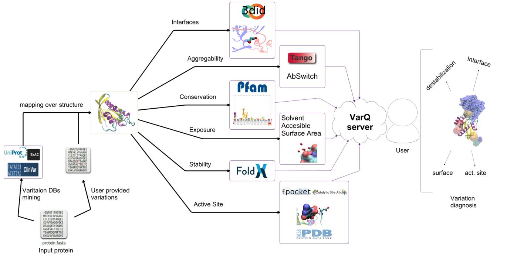

--- 
title:
- Predicción de patogenicidad en SNPs 
author:
- Martín Ezequiel Langberg
theme:
- Boadilla
colortheme:
- beaver
lang: es
header-includes:
- \usepackage{caption}
- \captionsetup[figure]{labelformat=empty}

---

# Introducción: ¿Qué son los SNPs?

{ width=350px }

---

# Introducción: Del ADN a las proteínas

{ width=450px }

---

# ¿Cómo se expresan los SNPs en el organismo?

{ width=250px }

---

# Introducción: Tipos de SNPs

::: block1
## Sustitución sinónima o \textit{silent}
El cambio en el nucleótido no modifica el aminoácido
:::

{ width=250px }

---

# Introducción: Tipos de SNPs

:::block2
## Sustituciones no sinónimas
Nonsense: Generan un codón de terminación o \textit{stop}
:::

{ width=250px }

---

# Introducción: Tipos de SNPs

:::block2
## Sustituciones no sinónimas
Missense: Generan un cambio de aminoácido en la proteína
:::

{ width=250px }

---

# Foco de estudio: Variantes \textit{missense}

::: block1
## Sustitución sinónima o \textit{silent}
* El cambio en el nucleótido no modifica el aminoácido
:::

:::block2
## Sustituciones no sinónimas
* Nonsense: Generan un codón de terminación o \textit{stop}
* Missense: Generan un cambio de aminoácido en la proteína

:::

---

# Problema biológico: detectar la patogenicidad de SNPs

* La mayoría de las variantes no sinónimas son raras (AF < .05\%) 
* Los estudios realizados con secuenciación tienen baja significación estadística
* Existen bases de datos biológicas que registran patogenicidad de variantes: Clinvar, Humsavar y otras

  Main gene name   AA change     Type of variant   dbSNP
  ---------------- ------------- ----------------- -------------
  A4GALT           p.Pro251Leu   Polymorphism      rs28940571
  A4GALT           p.Gln163Arg   Polymorphism      rs28915383
  A4GNT            p.Ala218Asp   Polymorphism      rs2246945
  AAAS             p.His160Arg   Disease           \-
  AAAS             p.Ser263Pro   Disease           rs121918550

  \center{Selección de columnas de tabla Humsavar (extracto)}

---

# Enfoque computacional: un problema de clasificación

* **Objetivo: Predecir patogenicidad de SNPs \textit{missense} humanos**

* Trabajos previos: 
	* VEST (Carter et al., 2013)	
	* FATHMM-MKL (Shihab et al., 2015)
	* REVEL (Ioannidis et al., 2016)
	
* Aprendizaje automático supervisado
* Dimensiones estructurales, físico-químicas de las proteínas, genómicas
* Análisis de importancia de las variables

---

# 

\begin{center}
\Huge Qué tan difícil es este problema?
\end{center}

---

# Primer modelo: Propiedades estructurales usando VarQ

::: {.block1}
{ width=250px }
:::

::: {.block2}
### Variables extraídas (cobertura)

:::: columns

::: column
* Variación de la energía
* SASA
* Porcentaje de SASA
* B-Factor
* Switchbility
:::

::: column
* Aggregability
* Conservación
* Interfaz 3DID
* Interfaz PDB
* **Active Site**
:::

::::

:::

---

# Filtrado de variantes del dataset VarQ

* Removimos variantes sin un status confirmado (\textit{risk factor}, \textit{likely benign}, \textit{uncertain significance})
* Priorizamos con el reporte de Humsavar (Pathogenic, Disease)
* Aproximadamente 7,500 variables: 72% patogénicas, 28% benignas

{ width=200px }

---

# Generación de modelos de aprendizaje automático

* Modelos clásicos usando \texttt{scikit-learn}
	* Support Vector Classifier (kernel radial)
	* Random Forest
	* Regresión logística
* Imputación de variables nulas
* Búsqueda de hiperparámetros usando \textit{3-fold Cross Validation}

---

# Comparación de modelos usando VarQ: Random Forest tiene el mejor AUC

                        SVC        LR       RF
  --------------------- ---------- -------- --------
  Precisión             0.72       0.75     **0.77**
  Recall                **1.00**   0.94     0.93
  AUC                   0.70       0.71     **0.74**
  $T_{fit}$             2m 39s     **1.17s** 9.82s
  $T_{pred}$            0.77s      **0.01s** 0.11s

---

# Resultados del modelo VarQ (Random Forest): La variable más importante es la Variación de la Energía

::: columns

:::: column
{ width=250px }
::::

:::: column
{ width=170px }
::::

:::

---

# 

\begin{center}
\Huge Cuál es el valor predictivo de las variables fisico-químicas de la proteína?
\end{center}

---

# Modelo: Propiedades Físico-Químicas de la proteína

* Uniprot: Proteoma humano completo
* Nuevas fuentes de variables:
	* ProtParam (Biopython) 
	* SNVBox
* Usando únicamente la tabla Humsavar: 
	* Más de 68 mil variantes (aprox. x10 Varq!)
	* Status aportado por Humsavar

{ width=350px }

---

# Generación de nuevas variables usando ProtParam

::: {.block1}
### Parámetros calculados
* Punto isoeléctrico
* Aromaticidad
* Índice de inestabilidad
* Flexibilidad
* Promedio de hidrofobicidad
:::

::: {.block2}
### Cambio en la variante
* Diferencia
* Log-ratio
:::

::: {.block3}
{ width=425px }
:::

---

# Variables físico-químicas extraídas de SNVBox

::: {.block1}
### Variables a nivel de aminoácido (considerando sustitución)
* Score BLOSUM, EX, GRANTHAM, PAM250, VB, JM
* Carga 
* Volumen 
* Polaridad
* Hidrofobia
* Transición
:::

::: {.block2}
### Variables a nivel de proteína (sin considerar sustitución)
* BINDING: Sitio de unión
* ACTIVE_SITE: Sitio activo
* LIPID: Unión con un lípido 
* METAL: Unión con un metal
* otras
:::

# Las matrices fueron las más relevantes

::: columns

:::: column
{ width=230px }
::::

:::: column
{ width=185px }
::::

:::
---

#

\begin{center}
\Huge Cuál es el valor predictivo de las variables genómicas?
\end{center}

---

# Modelo: Variables genómicas

* Identificador rsID: aproximadamente 55,000 variantes en Humsavar
	* 68% variantes benignas
	* 32% variantes patogénicas

* Fuentes de variables: 
	* SNVBox 
	* dbSNP 
	* Genome Browser (UCSC)

{ width=450px }

# Variables del modelo Genómico

::: {.block1}
### Variables de conservación genómica
* PhastCons a 46 vías (vertebrados)
* PhyloP a 46 vías (vertebrados)

:::

::: {.block2}
### Variables extraídas de SNVBox
* Conservación a nivel de exón
* Densidad de SNPs en HapMap
* Densidad de SNPs a nivel de exón
:::

::: {.block3}
### Variables relativas a la clase funcional
* Missense
* Nonsense
* Intrón
* y otras
:::

---

# La conservación genómica es importantísima!

::: columns

:::: column
{ width=235px }
::::

:::: column
{ width=175px }
::::

:::

---

#

\begin{center}
\Huge Podemos mejorar el modelo genómico integrando las variables físico-químicas?
\end{center}

---

# Integrando las variables físico-químicas y genómicas

* Dataset Humsavar: 68 mil variantes
* Cobertura variables genómicas: aprox. 80%
* Cobertura variable físico-químicas: misma que el dataset físico-químico
* Evaluamos un nuevo método de aprendizaje automático: XGBoost

{ width=250px }

# XGBoost supera a Random Forest

::: columns

:::: column
{ width=235px }
::::

:::: column
{ width=200px }
::::

:::

# Modelo Integral + VarQ

{ width=300px }

# Resultados del modelo Integral + VarQ (XGBoost)

::: columns

:::: column
{ width=235px }
::::

:::: column
{ width=175px }
::::

:::

# Comparación entre los distintos modelos

::: columns

:::: column
{ width=200px }
::::

:::: column
{ width=200px }
::::

:::

---

# Conclusión general:

* La combinación de distintas dimensiones del problema aportó buenos resultados, consiguiendo un AUC de 0.90
* El método estándar de cálculo de importancia de variables usado por scikit-learn puede ser engañoso en el caso de variables altamente correlacionadas
* Los mejores resultados fueron obtenidos por algoritmos de Boosting

---

# Trabajo futuro

* Aumentar la cobertura de las variables más importantes: La variación de la energía y las variables de conservación genómica
* Mejorar la búsqueda de hiperparámetros en XGBoost
* Evaluar SNPs \textit{nonsense} o no codificantes
* Mejoras metodológicas

# 

\begin{center}
\Huge Preguntas?
\end{center}

# 

\begin{center}
\Huge Muchas gracias!
\end{center}

